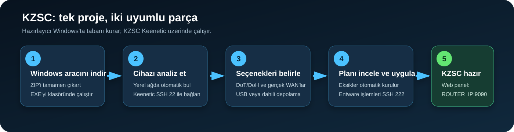
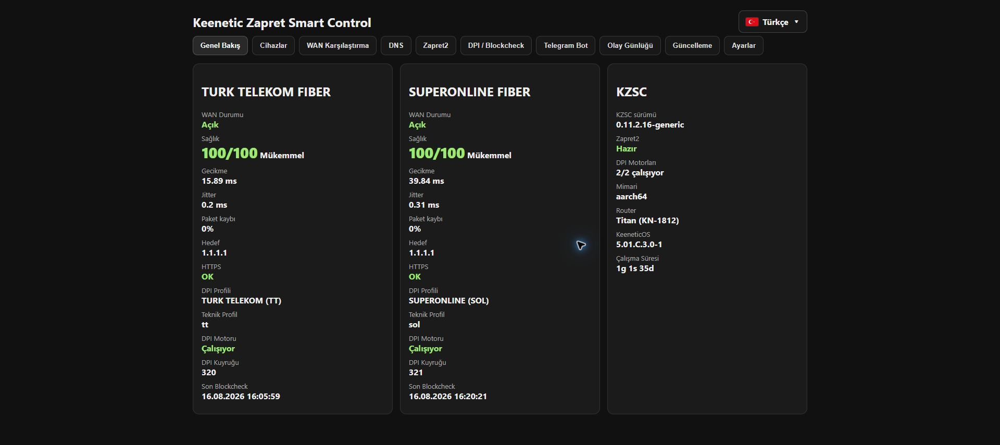

[Türkçe](README.tr.md) · **English**

# Keenetic Zapret Smart Control

KZSC is a capability-driven management layer for Zapret2, per-WAN DPI, Blockcheck, secure DNS, Telegram notifications, backups, and a bilingual Turkish/English web panel on Keenetic routers. The **KZSC Preparer** in this same project can build the required KeeneticOS/OPKG/Entware base from Windows and install the latest trusted KZSC release automatically.

Current release: `v0.11.2.25-generic`

<!-- KZSC_PREPARER_START: Keep this block when updating release documentation. -->
## Recommended assisted installation



1. Open the [latest GitHub Release](https://github.com/ssy1979/keenetic-zapret-smart-control/releases/latest).
2. Download and fully extract `KZSC-Hazirlayici-v1.2.6.zip` from Assets.
3. Run `KZSC-Hazirlayici.exe`.
4. Discover the Keenetic and analyze it with the SSH 22 administrator credentials.
5. Choose DoT/DoH, real Internet WANs, and USB/internal storage.
6. Review and apply the plan. The preparer completes Entware SSH 222 and installs KZSC.
7. Open `http://ROUTER_IP:9090/` after installation.

For first-time users, see the complete visual walkthrough: **[KZSC visual installation guide](docs/INSTALLATION.md)**. A detailed Turkish guide is available in [docs/KURULUM.md](docs/KURULUM.md).



### The two parts of the project

- **Windows: KZSC Preparer** — network discovery, SSH 22 analysis, missing KeeneticOS components, DoT/DoH, ISP DNS, USB/internal OPKG, Entware SSH 222, and automatic KZSC installation.
- **Router: KZSC** — the `/opt/kzsc` web panel, WAN/DPI/Blockcheck, Zapret2 management, DNS, Telegram, backup, and secure updates.

Preparer source: [`tools/kzsc-hazirlayici`](tools/kzsc-hazirlayici)
<!-- KZSC_PREPARER_END -->

## Supported router topology

The installer does not approve routers by a hard-coded model list. It validates the actual router before changing an existing installation:

- KeeneticOS Open Package support and Entware under `/opt`
- `dns-tls` and `dns-https` KeeneticOS components
- lighttpd with `mod_cgi`
- iptables mangle/filter, NFQUEUE, and queue bypass support
- a compatible Zapret2 CPU binary that executes successfully on the device
- one or more supported Internet uplinks

Supported uplinks are PPPoE, wired IPoE/Ethernet (DHCP or static, public or private IPv4 from an upstream router), and Keenetic WISP. L2TP/PPTP and mobile/USB modem WANs are intentionally outside the current release scope.

Models such as KN-1811, KN-1812, KN-1012, KN-3610, and KN-3611 are handled by the same discovery path. A model is compatible only when the on-device pre-flight passes; this avoids making an unverified model-name promise.

## Manual installation

The Windows preparer above remains the recommended path for new users. For manual installation, a working OPKG/Entware `/opt` base is sufficient: the installer detects and installs missing KeeneticOS DNS/netfilter components and required Entware packages. If a KeeneticOS component change reboots the router, the same verified installation resumes automatically after startup.

Upload the release archive through the Keenetic interface to `/opt/tmp`, connect over SSH, and run:

```sh
cd /opt/tmp
sha256sum -c keenetic-zapret-smart-control-v0.11.2.25-generic.tar.gz.sha256
tar -xzf keenetic-zapret-smart-control-v0.11.2.25-generic.tar.gz
cd keenetic-zapret-smart-control-v0.11.2.25-generic
sh install.sh
```

The installer first completes only missing dependencies and then runs a read-only compatibility gate before stopping services. If an upgrade fails later, the previous KZSC code and configuration are restored automatically. When a component installation requires a reboot, progress is available in `/opt/tmp/kzsc-bootstrap-resume.log`.

After installation:

```sh
kzsc status
kzsc preflight
kzsc audit full
```

The default panel is `http://ROUTER_LAN_IP:9090/`.

> One-time upgrade note: the updater included in v0.11.2.14 and v0.11.2.15 has a BusyBox `ash` variable-scope bug. Install the current release manually with the verified archive above. Self-update works normally from v0.11.2.16 onward.

## KZSC updates

The bilingual **Update** tab can check the trusted `ssy1979/keenetic-zapret-smart-control` GitHub release channel and install a newer `-generic` release manually. Automatic installation is opt-in and disabled by default; when enabled, the daemon checks every 30 minutes.

Before installation, KZSC requires the exact release asset names and trusted GitHub URLs, verifies the external SHA-256 file, rejects unsafe archive paths/links or oversized archives, and verifies the archive's internal `SHA256SUMS`. Downgrades are not offered, Blockcheck prevents installation while active, and the installer restores the previous code/configuration if an upgrade fails.

Update checks, settings, and results appear in the top operation notices. The former Event Log tab has been removed from the web panel; the protected backend audit log remains available for diagnostics and Telegram synchronization. When Telegram system notifications are enabled, a newly discovered release is announced once per version and the final update result is sent to the bot.

When Telegram commands are enabled, `/kzsc_update` opens the update menu. The authorized chat can check releases, inspect status, enable or disable automatic updates, and start an available update after an explicit confirmation button.

CLI equivalents:

```sh
kzsc update status
kzsc update check
kzsc update install
kzsc update auto on   # or: off
```

The **Settings** tab includes a confirmed **Restart KZSC** action. It restarts only the KZSC daemon and web interface and waits for the health endpoint to return. The separate **Restart Router** button beside it requires explicit confirmation and schedules a 30-second Keenetic system reboot through `ndmc`; Internet and local-network connectivity will be interrupted temporarily.

## Tests

On a POSIX development host:

```sh
sh tests/test-adaptive-wan.sh
sh tests/test-updater.sh
```

The suites cover one through four WANs, mixed PPPoE/IPoE/WISP discovery and mapping, per-WAN queues and CGI generation, queue exhaustion, unsupported WAN rejection, the absolute Blockcheck deadline guard, trusted-release pinning, downgrade rejection, automatic-update opt-in, and updater security guards.

## Zapret2 relationship

Zapret2 is not bundled in this repository or KZSC release archive. When requested by the operator, KZSC downloads an official Zapret2 release from `bol-van/zapret2`, asks its upstream architecture selector for a compatible binary, and verifies that the selected tools execute on the router. See [THIRD_PARTY_NOTICES.md](THIRD_PARTY_NOTICES.md).

KZSC is an independent community project and is not affiliated with Keenetic or the Zapret2 project. Use it only where lawful and permitted by your network provider and local rules.

## Türkçe kısa açıklama

KZSC; router modelini sabit bir listeden kabul etmek yerine cihazın gerçek KeeneticOS bileşenlerini, WAN türlerini, CPU mimarisini ve firewall yeteneklerini kurulumdan önce denetler. Desteklenen bağlantılar PPPoE, kablolu IPoE ve WISP'tir. Ayrıntılı Türkçe sürüm geçmişi ve kullanım notları [README.txt](README.txt) dosyasındadır.

Security reports: see [SECURITY.md](SECURITY.md). Contributions: see [CONTRIBUTING.md](CONTRIBUTING.md).

KZSC is released under the [MIT License](LICENSE). Third-party software keeps its own license.
