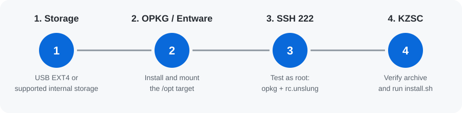
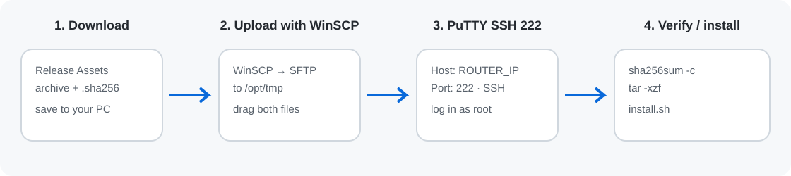
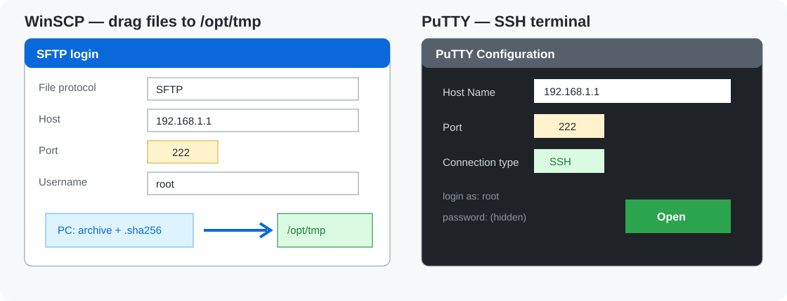

# KZSC visual installation guide

[← Project home](../README.md) · [🇹🇷 Türkçe rehber](KURULUM.md) · [Latest release](https://github.com/ssy1979/keenetic-zapret-smart-control/releases/latest)

> [!TIP]
> This guide uses **KZSC Preparer**, the easiest and recommended Windows installation method. You do not need to enter terminal commands.

## What you need

- A Windows 10/11 PC and your Keenetic router on the same local network.
- The router administrator username and password.
- A working Internet connection on the router.
- For a new Entware installation: supported internal storage or an attached EXT2/EXT3/EXT4 USB partition.

## Step 1 — Enable SSH on the router

In the Keenetic web interface, open **General system settings → Component options** and install or enable **SSH server**. Keep it reachable only from the local network.

This is the only router-side preparation required before starting the preparer.

## Step 2 — Download and open KZSC Preparer

1. Open the [latest release](https://github.com/ssy1979/keenetic-zapret-smart-control/releases/latest).
2. Under **Assets**, download `KZSC-Hazirlayici-*.zip`.
3. Right-click the ZIP and choose **Extract all**.
4. Open the extracted folder and run `KZSC-Hazirlayici.exe`.

> [!IMPORTANT]
> Keep `KZSC-Hazirlayici.exe` and its `_internal` folder together. Do not move the EXE on its own.

## Step 3 — Connect and analyse


1. Pick your language.
2. Select the found router, or enter its local IP address (often `192.168.1.1`).
3. Enter the Keenetic administrator credentials in **KeeneticOS SSH (22)**.
4. Select **Connect and analyse**.
5. Confirm the SSH fingerprint only if it belongs to your own router.

The app checks the router before making changes. Passwords are not saved.

## Step 4 — Choose storage and create the plan


Choose the storage shown by the app:

- **Existing Entware /opt**: keeps an already working Entware installation.
- **USB partition**: only detected EXT2/EXT3/EXT4 partitions are offered.
- **Internal storage**: shown only on compatible routers.

Leave **Install latest KZSC release automatically** enabled, then open **Plan and install** and choose **Create installation plan**.

## Step 5 — Apply the plan


Check that the router and storage target are correct, then choose **Apply plan**.

The preparer installs only what is missing, may restart the router if KeeneticOS components must change, then installs KZSC and verifies it. Do not turn off the router or close the app while the plan is running.

## Step 6 — Open KZSC

When the plan is complete, open this address on your local network:

```text
http://ROUTER_IP:9090/
```

Example: `http://192.168.1.1:9090/`


On the **Overview** page, confirm that KZSC and your WANs are healthy. Then configure Zapret2/DPI, DNS and devices as needed.

## Common questions

### The router was not found

Make sure the PC is on the main local network, temporarily disable a client VPN, then enter the router’s local IP manually. Guest Wi-Fi can block router management.

### SSH 22 cannot connect

Confirm that the KeeneticOS **SSH server** component is enabled, the administrator credentials are correct, and the router’s local SSH port is 22. Do not expose SSH to the Internet.

### USB storage is not displayed

The preparer never formats a disk. Check that the partition is EXT2, EXT3 or EXT4 and that KeeneticOS sees it as connected.

### The panel does not open

Use the local address `http://ROUTER_IP:9090/`. Do not expose the panel directly to the Internet. If the installation report shows an error, save its redacted log and open an issue without passwords or tokens.

## Manual fallback

Use this only when the Windows preparer cannot be used.



### A. Prepare a persistent `/opt` target

1. In the Keenetic web interface, open **General system settings → Component options**.
2. Install **Open Package support (OPKG)**. Keep the **SSH server** component enabled on the same screen.
3. In **Applications / Open Package** (called **Storage** on some models), choose the attached USB partition or supported internal storage as the target.
4. A USB partition must be **EXT2, EXT3 or EXT4**; EXT4 is preferred. The preparer never formats disks.
5. Select **Apply** and wait for KeeneticOS to finish. If the router restarts, wait until it is fully online again.
6. Return to the storage screen and confirm that the partition is **mounted** and the OPKG target is **active**.


> This screenshot shows the equivalent preparer choices: select **Existing Entware /opt** when a working target exists, or the detected USB/internal target for a new base.

### B. Verify SSH 222

When the Entware target is mounted, connect to the router’s **SSH 222** service from Windows PowerShell or macOS Terminal:

```sh
ssh -p 222 root@ROUTER_IP
```

For a new Entware installation, some Keenetic setups start with the password `keenetic`; use your own Entware root password on an existing installation. Never expose SSH to the Internet.

Run these four checks in the router session:

```sh
test -x /opt/bin/opkg && echo 'OK: opkg'
test -x /opt/bin/sh && echo 'OK: Entware shell'
test -x /opt/etc/init.d/rc.unslung && echo 'OK: Entware startup'
opkg update
```

The first three commands must each print `OK`; `opkg update` must download package lists without an error. If any check fails, `/opt` is not persistent or SSH 222 is not ready. Stop here, fix the storage target, reboot if necessary, and repeat the checks.

### C. Upload and install KZSC



#### 1) Download the files to your PC

1. Open the [latest release](https://github.com/ssy1979/keenetic-zapret-smart-control/releases/latest).
2. Under **Assets**, download the router archive named `keenetic-zapret-smart-control-v...-generic.tar.gz` and the `.sha256` file with the **same base name**. Keep both files in one folder.
3. Do not extract the archive or rename either file. The `.sha256` file is used for the integrity check.

#### 2) Upload to `/opt/tmp` with a graphical interface (WinSCP)

On Windows, [download WinSCP from its official site](https://winscp.net/eng/download.php) and install it. WinSCP is a secure SFTP window where you can drag files without typing upload commands.



1. Open WinSCP. Set **File protocol: SFTP**, **Host name: ROUTER_IP**, **Port number: 222**, **User name: root**.
2. Select **Login**. On the first connection, choose **Accept** only when the displayed host key belongs to your router.
3. The left panel is your PC and the right panel is the router. In the right panel open `/opt/tmp`. If it does not exist, connect with PuTTY first and run `mkdir -p /opt/tmp`.
4. Drag the downloaded `.tar.gz` and `.sha256` files from the left panel to `/opt/tmp` on the right. Wait for the transfer to finish before closing WinSCP.

> **Security:** use port **222** in WinSCP; do not confuse it with the KeeneticOS administration SSH port **22**. Keep SSH/SFTP restricted to your local network.

#### 3) Connect to SSH 222 with PuTTY

[Open PuTTY’s official download page](https://www.putty.org/) and install the Windows **MSI installer**.

The right side of the image above shows the PuTTY fields: router IP, port `222`, and **SSH**.

1. Open PuTTY. On the **Session** screen enter the router’s local IP (`192.168.1.1`, for example) in **Host Name (or IP address)**.
2. Set **Port** to `222`, select **SSH**, and choose **Open**.
3. If a host-key warning appears on the first connection, select **Accept** only when the fingerprint is your router’s.
4. At `login as:` type `root`; enter your Entware root password. Nothing appears while typing a password—this is normal.

If a terminal prompt appears, the connection succeeded. If it fails, re-check port `222`, the router IP, and that OPKG/SSH components are enabled.

#### 4) Verify and install on the router

```sh
cd /opt/tmp
sha256sum -c keenetic-zapret-smart-control-v*-generic.tar.gz.sha256
tar -xzf keenetic-zapret-smart-control-v*-generic.tar.gz
cd keenetic-zapret-smart-control-v*-generic
/opt/bin/sh install.sh
```

The installer checks the actual router capabilities and stops safely when the setup is unsupported.
