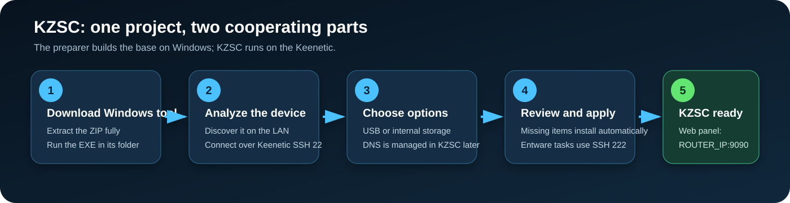
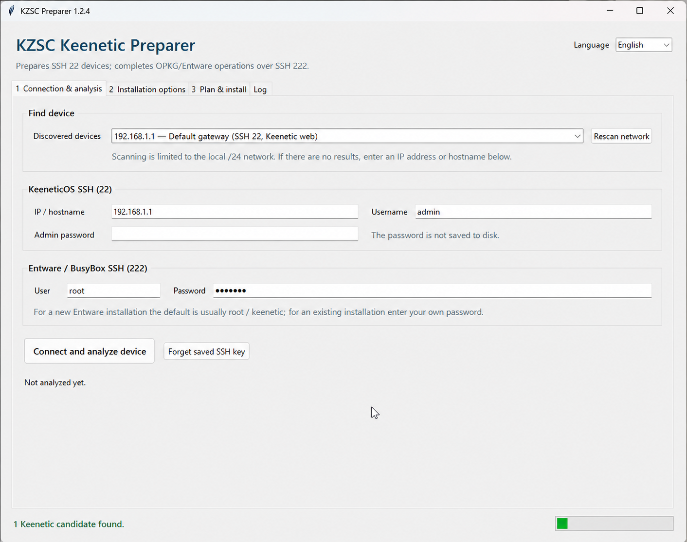
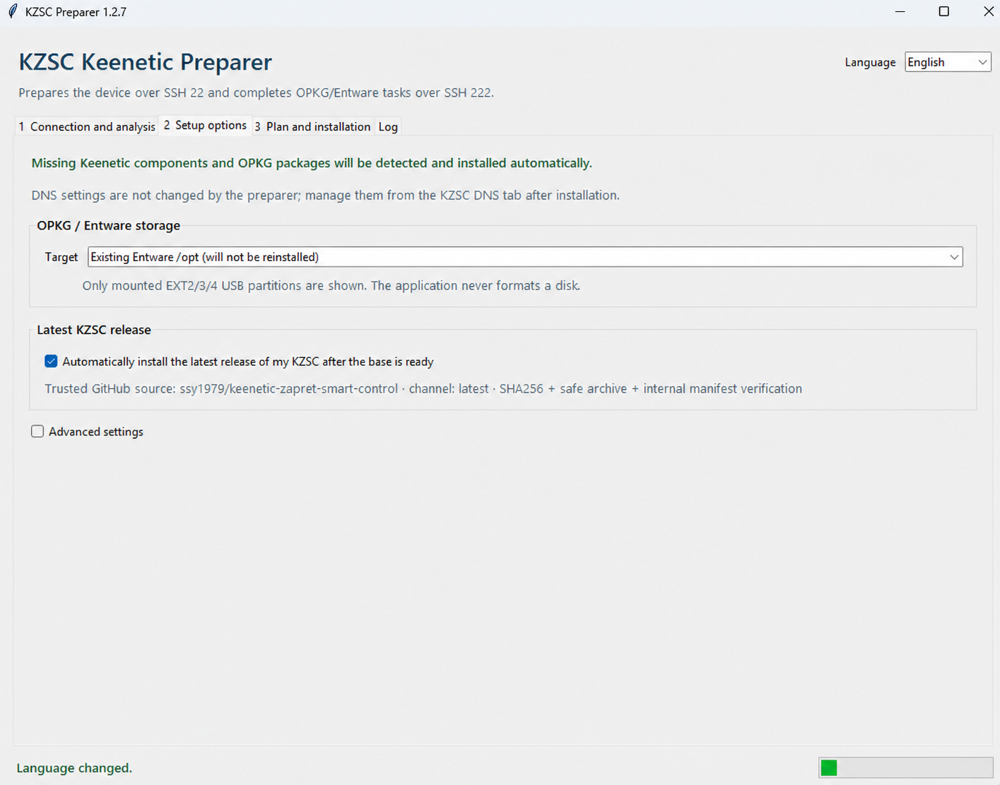
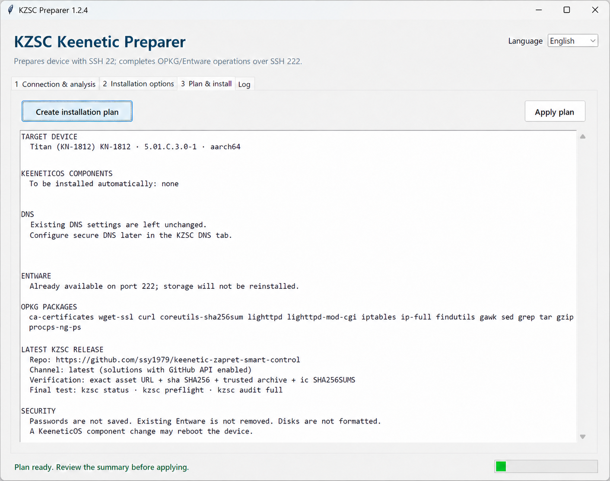
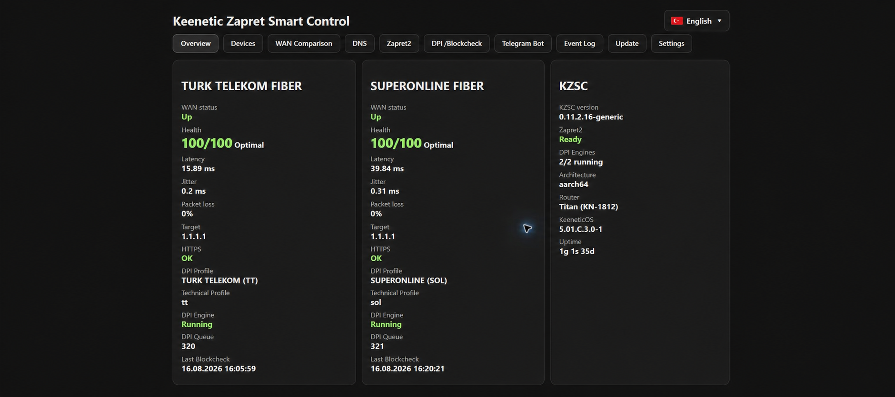
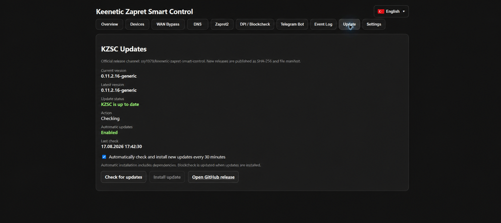

# KZSC visual installation guide

[Project home](../README.md) · [Türkçe rehber](KURULUM.md) · [GitHub Releases](https://github.com/ssy1979/keenetic-zapret-smart-control/releases/latest)

This guide is written for users who have never used SSH or Entware. Use the **KZSC Preparer** on Windows, or follow the manual macOS/SSH procedure below. DNS/DoT/DoH settings are not changed by the installation process and are managed later from KZSC's **DNS** tab.



## One project, two cooperating parts

1. **KZSC Preparer** runs on Windows and connects to KeeneticOS over SSH port 22. It prepares components, OPKG/Entware, SSH 222, and storage.
2. **Keenetic Zapret Smart Control (KZSC)** runs on the router under `/opt/kzsc`. The preparer downloads, verifies, and installs the latest trusted KZSC release from this same repository.

No terminal commands are required for the normal assisted path.

## Manual macOS installation

macOS is supported as a computer used to administer the router; KZSC itself runs on the Keenetic under `/opt/kzsc`. The macOS application is no longer distributed.

1. Install or enable KeeneticOS **Open Package support (OPKG)** and attach an EXT2/EXT3/EXT4 USB partition or select supported internal storage.
2. In KeeneticOS component options, install **SSH server**. Keep SSH available only on the local network.
3. After Entware is mounted, connect to the router's SSH service on port 222 as `root` and install the required packages:

   ```sh
   opkg update
   opkg install ca-bundle curl wget bash coreutils-sha256sum findutils grep sed gawk tar gzip ip-full iptables
   ```

4. Download the latest `keenetic-zapret-smart-control-v*-generic.tar.gz` and its `.sha256` file from [GitHub Releases](https://github.com/ssy1979/keenetic-zapret-smart-control/releases/latest). Verify the archive checksum on a trusted computer, then upload the archive to `/opt/tmp`.
5. On the router, extract and run the installer:

   ```sh
   cd /opt/tmp
   tar -xzf keenetic-zapret-smart-control-v*-generic.tar.gz
   cd keenetic-zapret-smart-control-v*-generic
   /opt/bin/sh install.sh
   ```

6. Follow the pre-flight output. It installs missing KeeneticOS/Entware components when possible, starts the web service, and prints the panel URL. Open `http://ROUTER_IP:9090/` and refresh the page once installation completes.

The installer performs runtime capability checks on the router. It does not require the removed source-ownership/purity checker.

## Before you start
## Before you start

You need:

- A Windows 10/11 PC for the Windows preparer, or a Mac with SSH access tools for the manual procedure, on the same local network as the Keenetic.
- The Keenetic administrator username and password.
- A working Internet connection on the router.
- For a new OPKG install, either an EXT2/EXT3/EXT4 USB partition or supported internal `storage:/` space.
- Stable power during installation.

KZSC does not approve routers from a hard-coded model list. It checks OPKG, storage, CPU architecture, firewall/NFQUEUE, DNS components, and supported WAN types on the device.

## 1. Back up the Keenetic configuration

Open **General System Settings** in the Keenetic web interface and save the `startup-config` system file to your computer. A component change can update KeeneticOS and reboot the router.

Official reference: [KeeneticOS component installation/removal](https://support.keenetic.com/explorer/kn-1613/en/16326-keeneticos-components-installation-removal.html)

## 2. Enable local KeeneticOS SSH port 22

1. Open **General System Settings**.
2. Select **Component options**.
3. Make sure the **SSH server** component is installed.
4. If you changed the component set, wait for the KeeneticOS update and reboot to finish.
5. Do not expose SSH to the Internet. Local private-interface access is sufficient.

Official reference: [SSH access to the Keenetic command line](https://support.keenetic.com/buddy-6/kn-3411/en/22340-ssh-remote-access-to-the-keenetic-command-line.html)

The SSH component is the only component that must exist before the preparer can connect. Other required KeeneticOS components are detected and queued automatically.

## 3. Download the Windows preparer

1. Open the [latest GitHub Release](https://github.com/ssy1979/keenetic-zapret-smart-control/releases/latest).
2. Under **Assets**, download `KZSC-Hazirlayici-v1.2.7.zip`.
3. Choose **Extract all** in Windows.
4. Open the extracted `KZSC-Hazirlayici` folder.
5. Run `KZSC-Hazirlayici.exe`.

Keep the EXE and `_internal` directory together. Do not move the EXE out of its folder.

## 4. Find and analyze the router



1. Select **English** from the language menu if needed.
2. Choose an automatically discovered Keenetic, or enter its local IP/host name manually.
3. Enter the KeeneticOS SSH 22 administrator credentials.
4. For an existing Entware install, enter its SSH 222 credentials. A new Entware install commonly starts with `root / keenetic`; change that default password after installation.
5. Click **Connect and analyze device**.
6. On the first connection, approve the SSH host-key fingerprint only after confirming that it belongs to your router.

Passwords are not written to disk, and credential-bearing CLI lines are excluded from diagnostics.

## 5. Select storage



DNS, DoT/DoH, ISP DNS, and WAN selection were removed from this screen. The preparer only builds the KeeneticOS/OPKG/Entware base and leaves DNS untouched; configure secure DNS after installation from the KZSC **DNS** tab.

### OPKG/Entware storage

- **Existing Entware /opt:** retained without reinstalling.
- **USB:** only detected EXT2/EXT3/EXT4 partitions are offered; the app never formats a disk.
- **Internal storage:** offered only when the router supports it.

Official reference: [Installing OPKG/Entware in internal memory](https://support.keenetic.com/titan/kn-1811/en/18482-installing-opkg-entware-in-the-router-s-internal-memory.html)

Leave automatic KZSC installation enabled. The preparer accepts only this repository's trusted `latest` release and requires the external SHA-256 value, safe archive paths, and the internal `SHA256SUMS` manifest before running `install.sh`.

## 6. Review the plan



Open **Plan and installation**, then click **Build installation plan**. Review the target router/architecture, component changes, storage, SSH 222 status, missing OPKG packages, and KZSC release checks.

If the storage target or any other plan item is unexpected, do not apply the plan. Return to the options tab and correct it.

## 7. Apply the plan

When the summary is correct, click **Apply plan**. The preparer will:

1. Validate the KZSC release before router changes.
2. Preview and install missing KeeneticOS components.
3. Reconnect after a required KeeneticOS reboot.
4. Leave existing DNS settings unchanged; secure DNS is configured later in KZSC.
5. Install Entware on the selected storage or preserve existing `/opt`.
6. Verify or enable Entware startup and BusyBox SSH port 222.
7. Install missing OPKG packages over SSH 222.
8. Verify and install the latest KZSC.
9. Run `kzsc status`, `kzsc preflight`, and `kzsc audit full`.

Do not power off the router or close the preparer while a component update or reboot is in progress.

## 8. Open the KZSC panel

Open this address from the local network:

```text
http://ROUTER_IP:9090/
```



Confirm that each WAN is up, health checks pass, DPI engines are running, and the expected KZSC version is shown.



The **Update** tab shows the installed/latest versions and trusted release channel. Automatic installation is opt-in; when enabled, KZSC checks every 30 minutes and never installs while Blockcheck is active.

## Troubleshooting

### Router is not discovered

- Make sure Windows is connected to the router's private/home network.
- Temporarily disconnect a client VPN and scan again.
- Enter the Keenetic local IP manually.
- Guest Wi-Fi may block access to router management.

### SSH 22 fails

- Verify that the KeeneticOS SSH server component is installed.
- Credentials are case-sensitive.
- The preparer expects local SSH port 22. Restore port 22 if you changed it.
- Do not enable public/WAN SSH access.

### Component catalog cannot be read

- Check the router Internet connection and clock.
- Retry later if the Keenetic update service is temporarily unavailable.
- The app can fall back to locally installed components, but still requires Keenetic's own component preview before writing changes.

### USB is not offered

- Confirm that the partition is EXT2, EXT3, or EXT4 and mounted in KeeneticOS.
- The preparer does not format storage. Back up data before any separate formatting operation.

### SSH 222 is unavailable

- Confirm that the Entware target remains attached.
- Use the current Entware root password for an existing install.
- Review the log for `/opt`, `rc.unslung`, and port 222 checks.

### The web panel does not open

- Review the final `status`, `preflight`, and `audit full` results.
- Open `http://ROUTER_IP:9090/` from the local network.
- Do not expose the panel directly to the Internet.

## Manual fallback

If the Windows preparer cannot be used, upload the router archive from the [latest GitHub Release](https://github.com/ssy1979/keenetic-zapret-smart-control/releases/latest) to `/opt/tmp`, verify its SHA-256, extract it, and run `install.sh`. A working OPKG/Entware `/opt` base must exist; the installer then completes missing KeeneticOS DNS/netfilter components and Entware packages automatically. If a component change reboots the router, installation resumes after startup and records progress in `/opt/tmp/kzsc-bootstrap-resume.log`. Storage selection and the initial OPKG/Entware setup remain device-specific and must be completed with the Preparer or Keenetic's official method.

## Security and support

- Never post router passwords, Telegram tokens, public IPs, KeenDNS names, backups, or diagnostics in a public issue.
- Report vulnerabilities privately through [GitHub Security Advisories](https://github.com/ssy1979/keenetic-zapret-smart-control/security/advisories/new).
- KZSC is an independent community project, not an official Keenetic or Zapret2 product.
