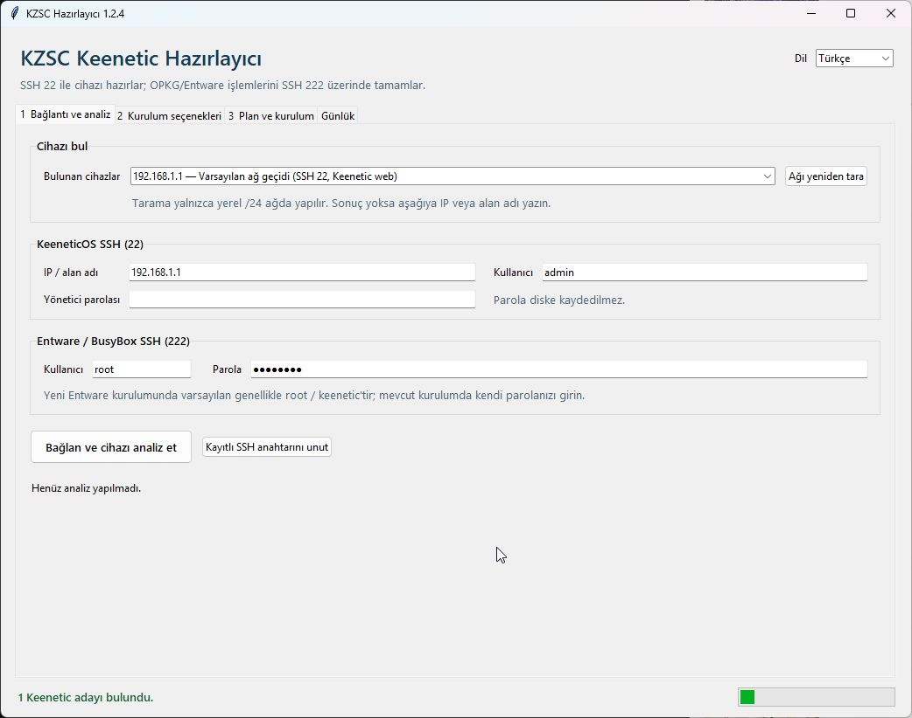
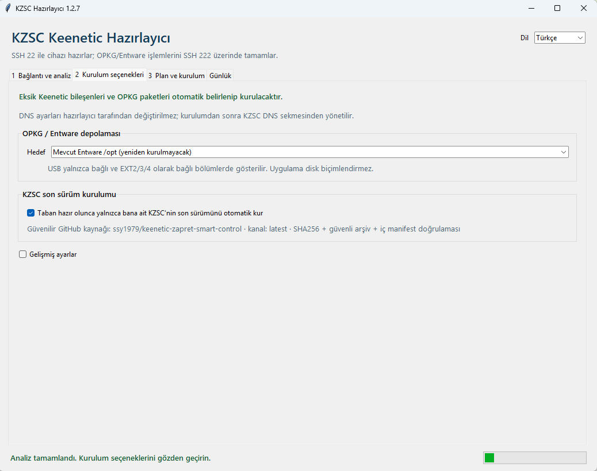
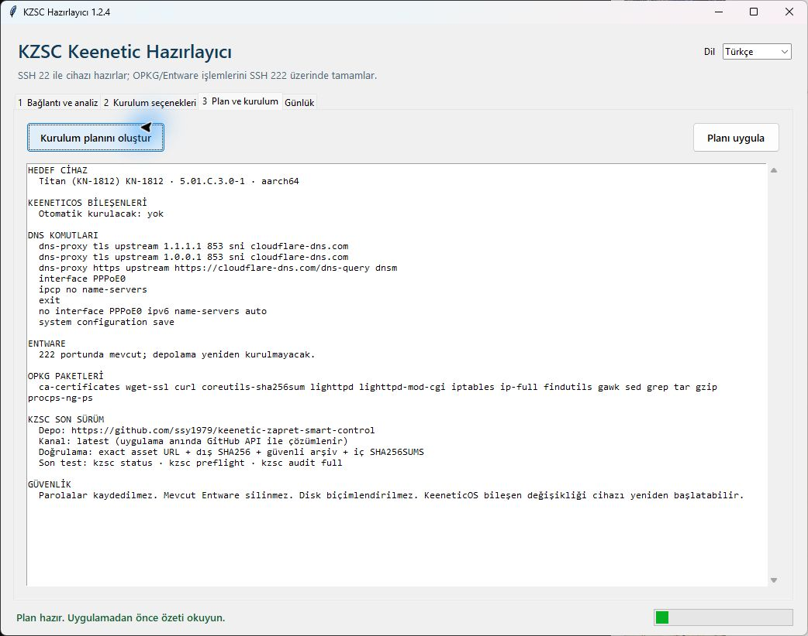
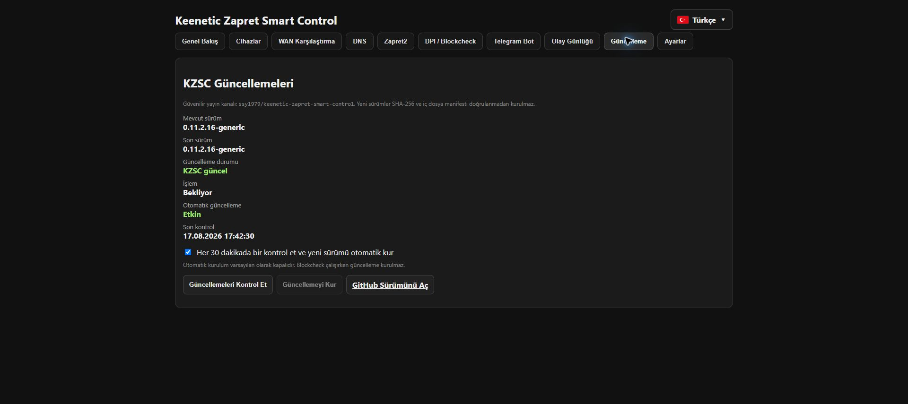

# KZSC görselli kolay kurulum rehberi

[Ana sayfa](../README.tr.md) · [English guide](INSTALLATION.md) · [GitHub Releases](https://github.com/ssy1979/keenetic-zapret-smart-control/releases/latest)

Bu rehber, daha önce SSH veya Entware kullanmamış birinin KZSC'yi Windows bilgisayardan Keenetic router'a kurabilmesi için hazırlanmıştır. Önerilen yöntem **KZSC Hazırlayıcı** uygulamasıdır; gerekli bileşenleri cihazın gerçek yeteneklerine göre denetler ve yapılacak her işlemi uygulamadan önce plan ekranında gösterir.


## İki parça ne işe yarar?

1. **KZSC Hazırlayıcı**, Windows'ta çalışan kurulum aracıdır. KeeneticOS'a SSH 22 ile bağlanır; OPKG/Entware, SSH 222, DoT/DoH, İSS DNS ayarları ve eksik bileşenleri hazırlar.
2. **Keenetic Zapret Smart Control (KZSC)**, router üzerinde `/opt/kzsc` altında çalışan asıl uygulamadır. Hazırlayıcı son güvenilir KZSC sürümünü aynı GitHub projesinden indirip doğrulayarak kurar.

Normal kullanımda terminal komutu yazmanız gerekmez.

## Başlamadan önce

Şunların hazır olduğundan emin olun:

- Windows 10 veya Windows 11 bilgisayar.
- Bilgisayar ve Keenetic aynı yerel ağda.
- Keenetic yönetici kullanıcı adı ve parolası.
- Keenetic'in çalışan internet bağlantısı.
- Yeni OPKG kurulacaksa uygun depolama:
  - EXT2, EXT3 veya tercihen EXT4 biçimli USB bölümü ya da
  - cihaz destekliyorsa dahili `storage:/` alanı.
- Kurulum sırasında router'ın ve bilgisayarın elektriği kesilmemeli.

> KZSC modeli isimden onaylamaz. OPKG, depolama, işlemci mimarisi, firewall/NFQUEUE ve WAN türlerini cihaz üzerinde test eder. Desteklenmeyen bir yetenekte kurulum planını engeller.

## 1. Keenetic ayarlarını yedekleyin

Keenetic web arayüzünde **Genel sistem ayarları** sayfasını açın. Sistem dosyaları bölümündeki `startup-config` dosyasını bilgisayarınıza kaydedin. Bileşen seti değişirse KeeneticOS güncellenebilir ve cihaz yeniden başlayabilir; bu nedenle yedek önerilir.

Resmî açıklama: [KeeneticOS bileşen kurulumu ve kaldırılması](https://support.keenetic.com/explorer/kn-1613/en/16326-keeneticos-components-installation-removal.html)

## 2. KeeneticOS SSH 22 erişimini hazırlayın

Hazırlayıcının ilk bağlantısı KeeneticOS'un kendi SSH sunucusuna, standart **22** numaralı porttan yapılır.

1. Keenetic web arayüzünde **Genel sistem ayarları** bölümünü açın.
2. **Bileşen seçenekleri** düğmesine basın.
3. **SSH sunucusu** bileşeninin kurulu olduğundan emin olun.
4. Değişiklik yaptıysanız KeeneticOS güncellemesinin tamamlanmasını ve router'ın yeniden başlamasını bekleyin.
5. SSH erişimini internetten açmanız gerekmez. Yerel ağ erişimi yeterlidir ve daha güvenlidir.

Resmî açıklama: [Keenetic komut satırına SSH erişimi](https://support.keenetic.com/buddy-6/kn-3411/en/22340-ssh-remote-access-to-the-keenetic-command-line.html)

> SSH bileşeni kurulu değilse hazırlayıcı cihaza bağlanamayacağı için bu tek bileşenin önceden etkin olması gerekir. Diğer gerekli KeeneticOS bileşenlerini hazırlayıcı otomatik belirler.

## 3. KZSC Hazırlayıcı'yı indirin

1. [Son GitHub sürümünü](https://github.com/ssy1979/keenetic-zapret-smart-control/releases/latest) açın.
2. **Assets** bölümünden `KZSC-Hazirlayici-v1.2.5.zip` dosyasını indirin.
3. ZIP'e sağ tıklayıp **Tümünü ayıkla** seçeneğini kullanın.
4. Çıkan `KZSC-Hazirlayici` klasörünü açın.
5. `KZSC-Hazirlayici.exe` dosyasını çalıştırın.

`KZSC-Hazirlayici.exe` ile `_internal` klasörü birlikte kalmalıdır. EXE'yi tek başına başka klasöre taşımayın.

## 4. Cihazı bulun ve analiz edin



1. Sağ üstteki **Dil** listesinden Türkçe veya English seçin.
2. Uygulama yerel `/24` ağındaki Keenetic adaylarını otomatik listeler.
3. Cihaz bulunamazsa IP adresini veya alan adını elle yazın. Varsayılan yerel adres çoğu kurulumda `192.168.1.1` olur; kendi router adresiniz farklı olabilir.
4. **KeeneticOS SSH (22)** bölümüne yönetici kullanıcı adı ve parolasını girin.
5. Mevcut Entware kullanıyorsanız **Entware / BusyBox SSH (222)** kullanıcı adı ve parolasını girin. Yeni kurulumlarda başlangıç hesabı genellikle `root / keenetic` olur; kurulumdan sonra bu parolayı değiştirmek gerekir.
6. **Bağlan ve cihazı analiz et** düğmesine basın.
7. İlk bağlantıda gösterilen SSH anahtar parmak izini yalnız cihazınıza ait olduğundan eminseniz onaylayın.

Parolalar diske kaydedilmez. Günlükte kullanıcı adı/parola gibi gizli SSH satırları gösterilmez.

## 5. DNS, WAN ve depolamayı seçin



### Şifreli DNS

- **DoT:** DNS over TLS.
- **DoH:** DNS over HTTPS.
- **Her ikisi de:** DoT ve DoH birlikte. Başlangıç için önerilen seçimdir.

Cloudflare, Google, Quad9 veya AdGuard seçilebilir. Özel sunucu yalnız ne kullandığınızı biliyorsanız gelişmiş ayarlardan girilmelidir.

Resmî açıklama: [Keenetic DoT ve DoH yapılandırması](https://support.keenetic.com/hero/kn-1011/en/25049-dot-and-doh-proxy-servers-for-dns-requests-encryption.html)

### İSS DNS'lerini yoksay

Şifreli DNS sunucuları eklendikten sonra IPv4 ve/veya IPv6 İSS DNS'lerini yoksayabilirsiniz. WAN listesinde:

- yalnız gerçek internet sağlayıcı oturumları kendi Keenetic açıklamalarıyla görünür,
- fiziksel alt Ethernet portları görünmez,
- LAN/köprü ve sonradan eklenen VPN tünelleri görünmez,
- birden fazla internet bağlantısında en altta **Hepsi** seçeneği bulunur.

Tek bağlantı seçilirse yalnız o WAN, **Hepsi** seçilirse algılanan bütün internet WAN'ları değiştirilir.

### OPKG / Entware depolaması

- **Mevcut Entware /opt:** Çalışan kurulum korunur ve yeniden kurulmaz.
- **USB bölümü:** Yalnız bağlı ve EXT2/EXT3/EXT4 olarak algılanan bölümler gösterilir. Uygulama diski biçimlendirmez.
- **Dahili depolama:** Yalnız cihaz gerçekten destekliyorsa gösterilir.

Resmî açıklama: [Keenetic dahili belleğe OPKG/Entware kurulumu](https://support.keenetic.com/titan/kn-1811/en/18482-installing-opkg-entware-in-the-router-s-internal-memory.html)

### KZSC son sürümü

**Taban hazır olunca KZSC'nin son sürümünü otomatik kur** seçeneğini açık bırakın. Hazırlayıcı yalnız bu deponun güvenilir `latest` sürümünü kabul eder; dış SHA-256, arşiv yolları ve iç `SHA256SUMS` manifesti doğrulanmadan kurulum betiği çalıştırılmaz.

## 6. Kurulum planını okuyun



1. **Plan ve kurulum** sekmesini açın.
2. **Kurulum planını oluştur** düğmesine basın.
3. Şu başlıkları kontrol edin:
   - hedef cihaz ve işlemci mimarisi,
   - kurulacak KeeneticOS bileşenleri,
   - uygulanacak DoT/DoH ve WAN komutları,
   - Entware hedefi ve SSH 222 durumu,
   - eksik OPKG paketleri,
   - kurulacak KZSC yayın kanalı ve doğrulama adımları.
4. Beklemediğiniz bir WAN, depolama hedefi veya DNS sunucusu görürseniz **Planı uygula** düğmesine basmayın; seçenekler sekmesine dönüp düzeltin.

## 7. Planı uygulayın

Plan doğruysa **Planı uygula** düğmesine basın.

Hazırlayıcı sırayla:

1. KZSC yayınını ve sağlama dosyalarını cihazda değişiklik yapmadan önce doğrular.
2. Eksik KeeneticOS bileşenlerini önizler ve kurar.
3. Gerekirse KeeneticOS yeniden başladıktan sonra yeniden bağlanır.
4. DoT/DoH ayarlarını ekler; başarılı olduktan sonra seçilen WAN'larda İSS DNS kullanımını kapatır.
5. Seçilen USB veya dahili alana Entware kurar ya da mevcut `/opt` kurulumunu korur.
6. Entware başlangıcını ve BusyBox SSH **222** portunu doğrular/etkinleştirir.
7. Eksik OPKG paketlerini SSH 222 üzerinden kurar.
8. Son KZSC sürümünü güvenli biçimde açar ve kurar.
9. `kzsc status`, `kzsc preflight` ve `kzsc audit full` kontrollerini çalıştırır.

KeeneticOS bileşen değişikliğinde router yeniden başlayabilir. Bu sırada cihazın elektriğini kesmeyin ve uygulamayı kapatmayın.

## 8. KZSC web panelini açın

Kurulum tamamlandığında tarayıcıda şu adresi açın:

```text
http://ROUTER_IP:9090/
```

Örnek: `http://192.168.1.1:9090/`


Genel Bakış ekranında her WAN'ın açık olduğunu, sağlık değerlerini, DPI motorlarını ve KZSC sürümünü kontrol edin.



**Güncelleme** sekmesinde mevcut/son sürüm, SHA-256 korumalı yayın kanalı ve otomatik güncelleme tercihi görünür. Otomatik kurulum varsayılan olarak kapalıdır; açılırsa yeni sürüm her 30 dakikada bir kontrol edilir ve Blockcheck çalışırken kurulum yapılmaz.

## Sık karşılaşılan sorunlar

### Cihaz bulunamadı

- Bilgisayarın Keenetic'in ana/yerel ağında olduğundan emin olun.
- VPN istemcisini geçici olarak kapatıp ağı yeniden tarayın.
- Keenetic'in yerel IP adresini elle yazın.
- Misafir Wi-Fi istemcilerinin router yönetimine erişimi engellenmiş olabilir.

### SSH 22 bağlantısı kurulamadı

- SSH sunucusu KeeneticOS bileşeninin kurulu olduğunu doğrulayın.
- Yönetici adı/parolasının büyük-küçük harfe duyarlı olduğunu unutmayın.
- SSH portunu daha önce değiştirdiyseniz hazırlayıcı şu an standart 22 portunu bekler; yerel yönetim portunu 22 yapın.
- SSH'yi internetten açmayın; yerel bağlantı yeterlidir.

### Bileşen kataloğu okunamadı

- Keenetic'in internet bağlantısını ve tarih/saatini kontrol edin.
- Keenetic güncelleme sunucusuna geçici erişim sorunu varsa bir süre sonra tekrar deneyin.
- Hazırlayıcı kurulu bileşenleri yerelden okuyabilir ancak herhangi bir değişiklikten önce Keenetic'in bileşen önizlemesinin başarılı olmasını zorunlu tutar.

### USB listede görünmüyor

- Bölümün EXT2, EXT3 veya EXT4 olduğundan emin olun.
- Diskin Keenetic arayüzünde bağlı ve erişilebilir göründüğünü kontrol edin.
- Uygulama disk biçimlendirmez; biçimlendirme gerekiyorsa verileri ayrıca yedekleyin.

### SSH 222 açılmadı

- Entware hedefinin Keenetic'te bağlı olduğunu kontrol edin.
- Mevcut Entware parolanızı doğru girdiğinizden emin olun.
- Günlük sekmesindeki `rc.unslung`, `/opt` ve 222 portu kontrollerini inceleyin.

### KZSC paneli açılmıyor

- Kurulum raporundaki `kzsc status`, `preflight` ve `audit full` sonuçlarını kontrol edin.
- `http://ROUTER_IP:9090/` adresini yerel ağdan açtığınızdan emin olun.
- Paneli doğrudan internete açmayın.

## Elle kurulum alternatifi

Windows hazırlayıcı kullanılamıyorsa [son GitHub Release](https://github.com/ssy1979/keenetic-zapret-smart-control/releases/latest) içindeki router arşivini `/opt/tmp` dizinine yükleyip SHA-256 doğrulamasından sonra `install.sh` çalıştırabilirsiniz. Elle yöntem, OPKG/Entware ve SSH 222 tabanının önceden hazır olmasını gerektirir; yeni kullanıcılar için hazırlayıcı önerilir.

## Güvenlik ve destek

- Router parolası, Telegram token'ı, genel IP, KeenDNS adı veya tanı arşivini public issue içinde paylaşmayın.
- Güvenlik açıklarını [GitHub Security Advisory](https://github.com/ssy1979/keenetic-zapret-smart-control/security/advisories/new) üzerinden özel bildirin.
- KZSC bağımsız bir topluluk projesidir; Keenetic veya Zapret2'nin resmî ürünü değildir.
