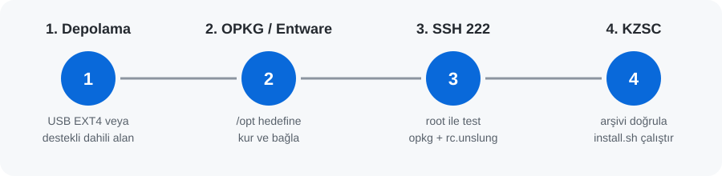

# KZSC görselli kolay kurulum rehberi

[← Ana sayfa](../README.tr.md) · [🇬🇧 English guide](INSTALLATION.md) · [Son sürüm](https://github.com/ssy1979/keenetic-zapret-smart-control/releases/latest)

> [!TIP]
> Bu rehber, Windows için önerilen ve en kolay yöntem olan **KZSC Hazırlayıcı** içindir. Terminal komutu yazmanız gerekmez.

## Gerekenler

- Windows 10/11 bilgisayar ile Keenetic router aynı yerel ağda olmalı.
- Router yönetici kullanıcı adı ve parolası gerekli.
- Router’ın internet bağlantısı çalışıyor olmalı.
- Yeni Entware kurulacaksa desteklenen dahili depolama ya da EXT2/EXT3/EXT4 biçimli USB bölümünü takın.

## 1 — Router’da SSH’ı açın

Keenetic web arayüzünde **Genel sistem ayarları → Bileşen seçenekleri** bölümünü açın. **SSH sunucusu** bileşenini kurun veya etkinleştirin. SSH yalnızca yerel ağdan erişilebilir kalsın.

Hazırlayıcıyı çalıştırmadan önce router’da yapılması gereken tek hazırlık budur.

## 2 — KZSC Hazırlayıcı’yı indirin ve açın

1. [Son sürüm](https://github.com/ssy1979/keenetic-zapret-smart-control/releases/latest) sayfasını açın.
2. **Assets** bölümünden `KZSC-Hazirlayici-*.zip` dosyasını indirin.
3. ZIP dosyasına sağ tıklayıp **Tümünü ayıkla** seçeneğine basın.
4. Çıkardığınız klasörde `KZSC-Hazirlayici.exe` dosyasını çalıştırın.

> [!IMPORTANT]
> `KZSC-Hazirlayici.exe` ile `_internal` klasörü birlikte kalmalıdır. EXE dosyasını tek başına taşımayın.

## 3 — Bağlanın ve analiz edin


1. Dili seçin.
2. Bulunan router’ı seçin; bulunamazsa yerel IP adresini yazın (çoğu kurulumda `192.168.1.1`).
3. **KeeneticOS SSH (22)** bölümüne router yönetici bilgilerini girin.
4. **Bağlan ve cihazı analiz et** düğmesine basın.
5. SSH anahtar parmak izini yalnız kendi router’ınıza ait olduğundan eminseniz onaylayın.

Uygulama router’ı değiştirmeden önce denetler. Parolalar diske kaydedilmez.

## 4 — Depolamayı seçin ve plan oluşturun


Uygulamada görünen uygun hedefi seçin:

- **Mevcut Entware /opt**: çalışan Entware kurulumunu korur.
- **USB bölümü**: yalnız algılanan EXT2/EXT3/EXT4 bölümler gösterilir.
- **Dahili depolama**: yalnız uyumlu router’larda görünür.

**KZSC’nin son sürümünü otomatik kur** seçeneğini açık bırakın. Ardından **Plan ve kurulum** bölümünü açın ve **Kurulum planını oluştur** seçeneğine basın.

## 5 — Planı uygulayın


Router ve depolama hedefi doğruysa **Planı uygula** düğmesine basın.

Hazırlayıcı yalnız eksik parçaları kurar; KeeneticOS bileşenleri değişecekse router yeniden başlayabilir. Ardından KZSC’yi kurar ve doğrular. Plan çalışırken router’ın elektriğini kesmeyin, uygulamayı kapatmayın.

## 6 — KZSC’yi açın

Plan tamamlandığında yerel ağdan şu adresi açın:

```text
http://ROUTER_IP:9090/
```

Örnek: `http://192.168.1.1:9090/`


**Genel Bakış** sayfasında KZSC ve WAN’ların sağlıklı olduğunu kontrol edin. Sonrasında Zapret2/DPI, DNS ve cihaz ayarlarını yapabilirsiniz.

## Sık sorulanlar

### Router bulunamadı

Bilgisayarın ana yerel ağda olduğundan emin olun. VPN istemcisini geçici kapatın, sonra router’ın yerel IP adresini elle yazın. Misafir Wi‑Fi router yönetimine erişimi engelleyebilir.

### SSH 22 bağlanmıyor

KeeneticOS **SSH sunucusu** bileşeninin açık olduğunu, yönetici bilgilerinin doğru olduğunu ve yerel SSH portunun 22 olduğunu kontrol edin. SSH’ı internete açmayın.

### USB listede yok

Hazırlayıcı diski biçimlendirmez. Bölümün EXT2, EXT3 veya EXT4 olduğundan ve KeeneticOS tarafından bağlı göründüğünden emin olun.

### Panel açılmıyor

Yerel ağdan `http://ROUTER_IP:9090/` adresini kullanın. Paneli doğrudan internete açmayın. Kurulum raporunda hata varsa gizli bilgiler maskelenmiş günlüğü kaydedin; parola veya token paylaşmadan issue açın.

## Manuel alternatif

Yalnız Windows Hazırlayıcı kullanılamıyorsa uygulayın:



### A. Kalıcı `/opt` hedefini hazırlayın

1. Keenetic web arayüzünde **Genel sistem ayarları → Bileşen seçenekleri** bölümünü açın.
2. **Open Package support (OPKG)** bileşenini kurun. Aynı ekranda **SSH sunucusu** da etkin olmalı.
3. **Uygulamalar / Open Package** (bazı modellerde **Depolama**) ekranında hedef olarak bağlı USB bölümünü veya desteklenen dahili depolamayı seçin.
4. USB kullanıyorsanız bölüm **EXT2, EXT3 veya EXT4** olmalı; tercihen EXT4 kullanın. Hazırlayıcı diski biçimlendirmez.
5. **Uygula** düğmesine basın ve KeeneticOS’un işlemi tamamlamasını bekleyin. Router yeniden başlarsa tamamen açılmasını bekleyin.
6. Aynı depolama ekranında bölümün **bağlı/mounted** ve OPKG hedefinin **aktif** göründüğünü kontrol edin.


> Bu ekran görüntüsü Hazırlayıcı’daki karşılığı gösterir: çalışan bir `/opt` varsa **Mevcut Entware /opt**, yeni taban kurulacaksa algılanan USB veya dahili depolama seçilir.

### B. SSH 222’yi doğrulayın

Entware hedefi bağlıyken bilgisayardan router’a **SSH 222** ile bağlanın. Windows PowerShell veya macOS Terminal’de:

```sh
ssh -p 222 root@ROUTER_IP
```

Yeni Entware kurulumunda ilk parola bazı Keenetic kurulumlarında `keenetic` olabilir; mevcut kurulumda kendi Entware root parolanızı kullanın. Parolayı değiştirmeden internete açık SSH kullanmayın.

Router SSH oturumunda şu dört komutu çalıştırın:

```sh
test -x /opt/bin/opkg && echo 'OK: opkg'
test -x /opt/bin/sh && echo 'OK: Entware shell'
test -x /opt/etc/init.d/rc.unslung && echo 'OK: Entware startup'
opkg update
```

İlk üç komutun her biri `OK` yazmalı; `opkg update` hata vermeden paket listelerini indirmeli. Herhangi biri başarısızsa `/opt` kalıcı değildir veya SSH 222 hazır değildir: kuruluma geçmeyin, depolama hedefini düzeltip router’ı yeniden başlatın ve tekrar kontrol edin.

### C. KZSC arşivini yükleyip kurun

1. [Son sürüm](https://github.com/ssy1979/keenetic-zapret-smart-control/releases/latest) sayfasından router arşivi ile aynı ada sahip `.sha256` dosyasını indirin.
2. İki dosyayı router’daki `/opt/tmp` klasörüne yükleyin (SCP/SFTP kullanabilirsiniz).
3. SSH 222 oturumunda doğrulayıp kurun:

```sh
cd /opt/tmp
sha256sum -c keenetic-zapret-smart-control-v*-generic.tar.gz.sha256
tar -xzf keenetic-zapret-smart-control-v*-generic.tar.gz
cd keenetic-zapret-smart-control-v*-generic
/opt/bin/sh install.sh
```

Kurucu router’ın gerçek yeteneklerini denetler; desteklenmeyen kurulumlarda güvenli biçimde durur.
